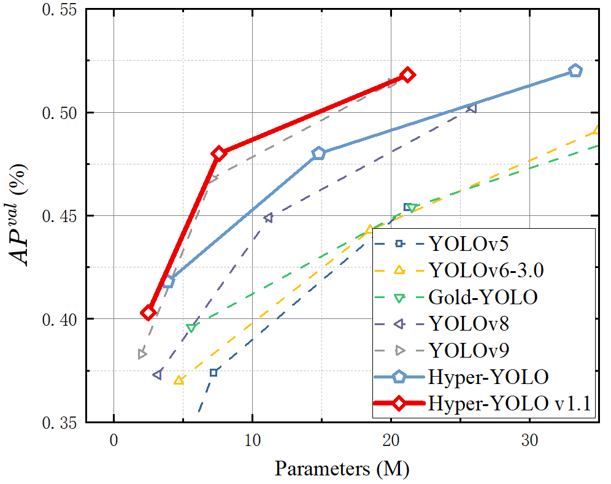
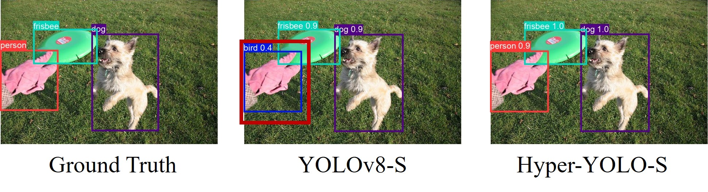
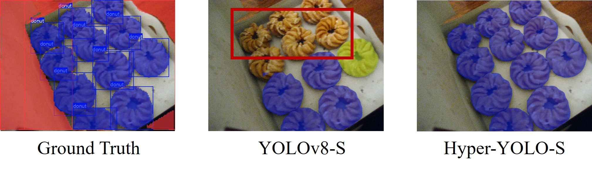

# Hyper-YOLO

[Hyper-YOLO: When Visual Object Detection Meets Hypergraph Computation.](https://www.arxiv.org/abs/2408.04804)

Yifan Feng, Jiangang Huang, Shaoyi Du, Shihui Ying, Jun-Hai Yong, Yipeng Li, Guiguang Ding, Rongrong Ji, and Yue Gao. 

<details>
  <summary>
  <font size="+1">Abstract</font>
  </summary>
We introduce Hyper-YOLO, a new object detection method that integrates hypergraph computations to capture the complex high-order correlations among visual features. Traditional YOLO models, while powerful, have limitations in their neck designs that restrict the integration of cross-level features and the exploitation of high-order feature interrelationships. To address these challenges, we propose the Hypergraph Computation Empowered Semantic Collecting and Scattering (HGC-SCS) framework, which transposes visual feature maps into a semantic space and constructs a hypergraph for high-order message propagation. This enables the model to acquire both semantic and structural information, advancing beyond conventional feature-focused learning.
Hyper-YOLO incorporates the proposed Mixed Aggregation Network (MANet) in its backbone for enhanced feature extraction and introduces the Hypergraph-Based Cross-Level and Cross-Position Representation Network (HyperC2Net) in its neck. HyperC2Net operates across five scales and breaks free from traditional grid structures, allowing for sophisticated high-order interactions across levels and positions. This synergy of components positions Hyper-YOLO as a state-of-the-art architecture, as evidenced by its superior performance on the COCO dataset. Hyper-YOLO-N significantly outperforms the advanced YOLOv8-N with 12\% $\text{AP}^{val}$ improvements. Compared with SOTA Gold-YOLO-N, Hyper-YOLO-N achieves 5\% $\text{AP}^{val}$ improvement with only 72\% parameters.
</details>


# Performance on MS COCO



## Hyper-YOLO

Our Hyper-YOLO enhances the YOLOv8 architecture with hypergraph computation. The comparsion of four scale models are provided in the following table.

| Model            | Test Size | $AP^{val}$ | $AP^{val}_{50}$ | Params | FLOPs |
| ---              | ---       | ---  | ---  | ---    | ---     | 
| YOLOv8-N         | 640       | 37.3 | 52.6 | 3.2 M  | 8.7 G   |
| YOLOv8-S         | 640       | 44.9 | 61.8 | 11.2 M | 28.6 G  |
| YOLOv8-M         | 640       | 50.2 | 67.2 | 25.9 M | 78.9 G  |
| YOLOv8-L         | 640       | 52.9 | 69.8 | 43.7 M | 165.2 G |
| HyperYOLO-T      | 640       | 38.5 | 54.5 | 3.2M   | 9.6G    |
| HyperYOLO-N      | 640       | 41.8 | 58.3 | 4.0M   | 11.4G   |
| HyperYOLO-S      | 640       | 48.0 | 65.1 | 14.8M  | 39.0G   |
| HyperYOLO-M      | 640       | 52.0 | 69.0 | 33.8M  | 103.3G  |
| HyperYOLO-L      | 640       | 53.8 | 70.9 | 56.3M  | 211.0G  |


## Hyper-YOLO v1.1
Furthermore, we replace the neck of YOLOv9 with the proposed HyperC2Net of our Hyper-YOLO, termed Hyper-YOLOv1.1. The source codes of Hyper-YOLOv1.1 are avaiable in [here](https://github.com/iMoonLab/Hyper-YOLOv1.1). 

Clearly, in each scale, the Hyper-YOLOv1.1 outperforms the YOLOv9, which demonstrates the effectiveness of our HyperC2Net in capturing high-order feature correlations. The comparison of four scale models are provided in the following table

| Model            | Test Size | $AP^{val}$ | $AP^{val}_{50}$ | Params | FLOPs |
| ---              | ---       | ---  | ---  | ---    | ---     | 
| YOLOv9-T         | 640       | 38.3 | 53.1 | 2.0M   | 7.7G    |
| YOLOv9-S         | 640       | 46.8 | 63.4 | 7.1M   | 26.4G   |
| YOLOv9-M         | 640       | 51.4 | 68.1 | 20.0M  | 76.3G   |
| YOLOv9-C         | 640       | 53.0 | 70.2 | 25.3M  | 102.1G  |
| Hyper-YOLOv1.1-T | 640       | 40.3 | 55.6 | 2.5M   | 10.8G   |
| Hyper-YOLOv1.1-S | 640       | 48.0 | 64.5 | 7.6M   | 29.9G   |
| Hyper-YOLOv1.1-M | 640       | 51.8 | 69.2 | 21.2M  | 87.4G   |
| Hyper-YOLOv1.1-C | 640       | 53.2 | 70.4 | 29.8M  | 115.5G  |


# Installation

Clone repo and create conda environment (recommended).
Then install requirements.txt in a Python>=3.8.0 environment, including PyTorch>=1.8.
The command is as follows.

```bash
git clone https://github.com/iMoonLab/Hyper-YOLO.git  # clone
cd Hyper-YOLO
conda create -n Hyper-YOLO python=3.8
conda activate Hyper-YOLO
pip install -r requirements.txt  # install
```
You can also use the environment.yaml file and the conda command to install the required environment.
```bash
conda env create -f environment.yaml
```

# Datasets
Data Preparation: Download the MS COCO dataset images (training, validation, and test sets) and corresponding labels, or prepare your custom dataset as shown below. Additionally, modify the dataset path in ultralytics/cfg/datasets/coco.yaml to reflect the location of your data.
```bash
coco
--images
  --train2017
  --val2017
--labels
  --train2017
  --val2017
```
# Training
Most of training configurations can change in the "Train settings" section of ultralytics/cfg/default.yaml. 
The key factors are model, data, img, epoches, batch, device and training hyperparameters.
For example, you can use "model: hyper-yolon.yaml" to train an object detection model.
```bash
python ultralytics/models/yolo/detect/train.py 
```

# Evaluation
Most of evaluation configurations can change in the "Val/Test settings" section of ultralytics/cfg/default.yaml. 
The key factors are model(weight), data, img, batch, conf, iou, half.
```bash
python ultralytics/models/yolo/detect/val.py
```
## Detection
Most of predict configurations can change in the "Predict settings" section of ultralytics/cfg/default.yaml.
The key factors are model(weight), source, img, conf, iou.
```bash
python ultralytics/models/yolo/detect/predict.py
```


## Segmentation
Here, our instance segmentation model configuration remains consistent with YOLOv8, by changing the object detection output head to an instance segmentation output head, while the backbone and neck remain unchanged. The model's training and testing process is similar to that of object detection.
For example, you can use "model: hyper-yolon-seg.yaml" to train an instance segmentation model.
```bash
python ultralytics/models/yolo/segment/train.py
python ultralytics/models/yolo/segment/val.py
python ultralytics/models/yolo/segment/predict.py 
```



# Export
Here is an example code for exporting an ONNX model. If you need to export other formats, please refer to our example code and the YOLOv8 documentation.
```bash
python ultralytics/utils/export_onnx.py
```

# Acknowledgement
Our code is built based on the [YOLOv8](https://github.com/ultralytics/ultralytics).
Thanks for their great work!

# Citation
If you find our work useful in your research, please consider citing:

```bibtex
xxx
```

# About Hypergraph Computation
Hypergraph computation is a powerful tool to capture high-order correlations among visual features. Compared with graphs, each hyperedge in a hypergraph can connect more than two vertices, which is more flexible to model complex correlations. Now, learning with high-order correlations still remains a under-explored area in computer vision. We hope our work can inspire more research in this direction. If you are interested in hypergraph computation, please refer to our series of works on hypergraph computation in the follows:

- [Hypergraph Learning: Methods and Practices](https://ieeexplore.ieee.org/abstract/document/9264674)
- [Hypergraph Nerual Networks](https://arxiv.org/abs/1809.09401)
- [HGNN+: General Hypergraph Nerual Networks](https://ieeexplore.ieee.org/document/9795251/)
- [Hypergraph Isomorphism Computation](https://arxiv.org/pdf/2307.14394)

# Contact
Hyper-YOLO is maintained by [iMoon-Lab](http://moon-lab.tech/), Tsinghua University. If you have any questions, please feel free to contact us via email: [Yifan Feng](mailto:evanfeng97@gmail.com) and [Jiangang Huang](mailto:mywhy666@stu.xjtu.edu.cn).
